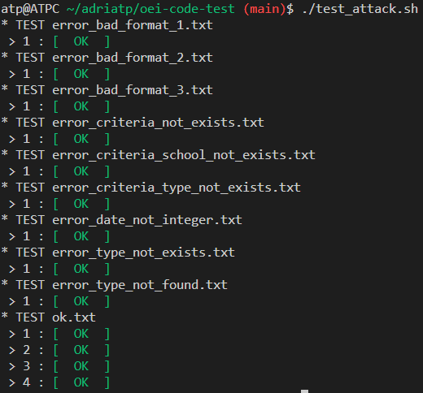

# OEI Code Test

## Versiones de programas

```bash
ruby 3.2.0
mysql 8.0.33-0ubuntu0.20.04.2
```

## Ejecución del servidor

```bash
git clone git@github.com:adriatp/oei-code-test.git
cd oei-code-test
cp application.example.yml application.yml
# Rellenamos application.yml con las credenciales de MySQL
bundle install
rails db:create db:migrate db:seed
rails s  
```

## Testing

Para ejecutar las pruebas de test, si estamos en ubuntu, simplemente ejecutamos el script

```bash
./test_attach.sh
```



### Comentarios

#### Script `test_attach.sh`

1. Establecer el puerto de la aplicación (`8888` -> `3000`)
2. Cambio en el endpoint (`radar` -> `api_app/v1/editions/filter`)
3. Ejecución de todos los ficheros `.txt` de la carpeta `test_cases`

#### Ficheros de test

- El test proporcionado por el enunciado es `test_cases/ok.txt`
- He borrado un par de espacios que se esperaba despues de algunos atributos 'date' ya que no estan presentes todas los inputs
- En el test 2 he cambiado el valor esperado 'de' por 'en' ya que así está en curso de entrada
- Interpreté que 'closest' devolvía cursos de la próxima edición y 'latest' de la última (posteriores a fecha actual) pero en el test 4 devuelve un curso de una edición anterior así que para cumplir con el test hice que no se apliquen estos criterios en caso de solo tener que filtrar temporalmente en una sola edición
